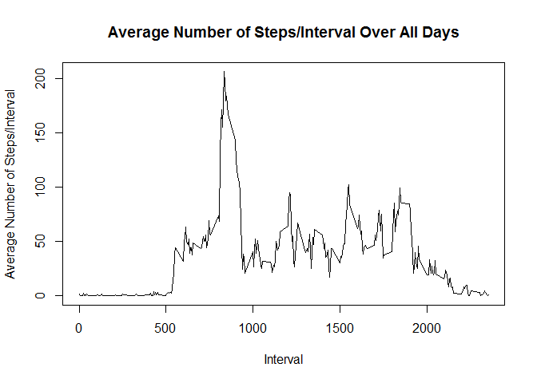
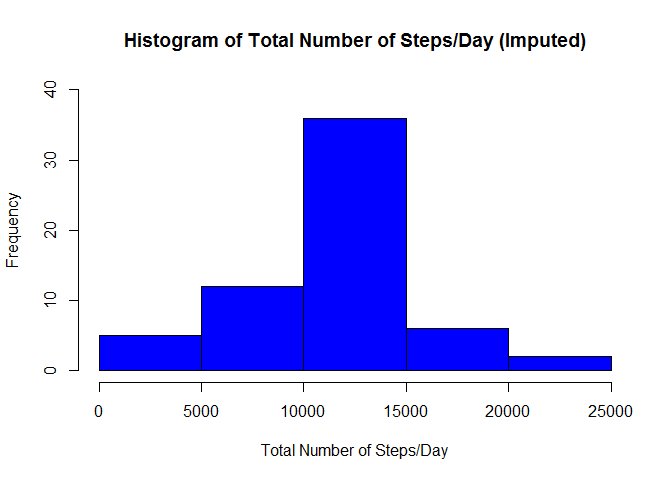

# Reproducible Research: Peer Assessment 1


## Loading and preprocessing the data
### 1.Load the data (i.e. read.csv())

```r
setwd("C:/Users/Bob/Desktop/DS Specialization/5_Reproducible_Research/w2_assignment/RepData_PeerAssessment1/")
#fileUrl <- "https://d396qusza40orc.cloudfront.net/repdata%2Fdata%2Factivity.zip"
#download.file(fileUrl,destfile="../repdata_data_activity.zip")
unzip(zipfile="activity.zip")
activity  <- read.csv("activity.csv")
summary(activity)
```

```
##      steps                date          interval     
##  Min.   :  0.00   2012-10-01:  288   Min.   :   0.0  
##  1st Qu.:  0.00   2012-10-02:  288   1st Qu.: 588.8  
##  Median :  0.00   2012-10-03:  288   Median :1177.5  
##  Mean   : 37.38   2012-10-04:  288   Mean   :1177.5  
##  3rd Qu.: 12.00   2012-10-05:  288   3rd Qu.:1766.2  
##  Max.   :806.00   2012-10-06:  288   Max.   :2355.0  
##  NA's   :2304     (Other)   :15840
```

### 2.Process/transform the data (if necessary) into a format suitable for your analysis

```r
activity_noNA<-na.omit(activity)
summary(activity_noNA)
```

```
##      steps                date          interval     
##  Min.   :  0.00   2012-10-02:  288   Min.   :   0.0  
##  1st Qu.:  0.00   2012-10-03:  288   1st Qu.: 588.8  
##  Median :  0.00   2012-10-04:  288   Median :1177.5  
##  Mean   : 37.38   2012-10-05:  288   Mean   :1177.5  
##  3rd Qu.: 12.00   2012-10-06:  288   3rd Qu.:1766.2  
##  Max.   :806.00   2012-10-07:  288   Max.   :2355.0  
##                   (Other)   :13536
```


## What is mean total number of steps taken per day?
### 1.Calculate the total number of steps taken per day

```r
table_stepsPerDay<-aggregate(steps ~ date, activity_noNA, sum)
table_stepsPerDay
```

```
##          date steps
## 1  2012-10-02   126
## 2  2012-10-03 11352
## 3  2012-10-04 12116
## 4  2012-10-05 13294
## 5  2012-10-06 15420
## 6  2012-10-07 11015
## 7  2012-10-09 12811
## 8  2012-10-10  9900
## 9  2012-10-11 10304
## 10 2012-10-12 17382
## 11 2012-10-13 12426
## 12 2012-10-14 15098
## 13 2012-10-15 10139
## 14 2012-10-16 15084
## 15 2012-10-17 13452
## 16 2012-10-18 10056
## 17 2012-10-19 11829
## 18 2012-10-20 10395
## 19 2012-10-21  8821
## 20 2012-10-22 13460
## 21 2012-10-23  8918
## 22 2012-10-24  8355
## 23 2012-10-25  2492
## 24 2012-10-26  6778
## 25 2012-10-27 10119
## 26 2012-10-28 11458
## 27 2012-10-29  5018
## 28 2012-10-30  9819
## 29 2012-10-31 15414
## 30 2012-11-02 10600
## 31 2012-11-03 10571
## 32 2012-11-05 10439
## 33 2012-11-06  8334
## 34 2012-11-07 12883
## 35 2012-11-08  3219
## 36 2012-11-11 12608
## 37 2012-11-12 10765
## 38 2012-11-13  7336
## 39 2012-11-15    41
## 40 2012-11-16  5441
## 41 2012-11-17 14339
## 42 2012-11-18 15110
## 43 2012-11-19  8841
## 44 2012-11-20  4472
## 45 2012-11-21 12787
## 46 2012-11-22 20427
## 47 2012-11-23 21194
## 48 2012-11-24 14478
## 49 2012-11-25 11834
## 50 2012-11-26 11162
## 51 2012-11-27 13646
## 52 2012-11-28 10183
## 53 2012-11-29  7047
```

### 2.Make a histogram of the total number of steps taken each day

```r
hist(table_stepsPerDay$steps, main="Histogram of Total Number of Steps/Day", 
     xlab="Total Number of Steps/Day", col="blue", ylim=c(0,40))
```

<!-- -->

### 3.Calculate and report the mean and median of the total number of steps taken per day

```r
summary(table_stepsPerDay$steps)
```

```
##    Min. 1st Qu.  Median    Mean 3rd Qu.    Max. 
##      41    8841   10760   10770   13290   21190
```


## What is the average daily activity pattern?
### 1.Make a time series plot (i.e. type = "l") of the 5-minute interval (x-axis) and the average number of steps taken, averaged across all days (y-axis)

```r
table_meanStepsPerInterval<-aggregate(steps ~ interval, activity_noNA, mean)
plot(table_meanStepsPerInterval$interval, table_meanStepsPerInterval$steps, 
     type = "l", main="Average Number of Steps/Interval Over All Days", xlab="Interval",
     ylab="Average Number of Steps/Interval")
```

<!-- -->

### 2.Which 5-minute interval, on average across all the days in the dataset, contains the maximum number of steps?

```r
maxStepsRowID <- which.max(table_meanStepsPerInterval$steps)
table_meanStepsPerInterval[maxStepsRowID,]
```

```
##     interval    steps
## 104      835 206.1698
```


## Imputing missing values
### Note that there are a number of days/intervals where there are missing values (coded as NA). The presence of missing days may introduce bias into some calculations or summaries of the data.
### 1.Calculate and report the total number of missing values in the dataset (i.e. the total number of rows with NAs)

```r
colSums(is.na(activity))
```

```
##    steps     date interval 
##     2304        0        0
```

### 2.Devise a strategy for filling in all of the missing values in the dataset. The strategy does not need to be sophisticated. For example, you could use the mean/median for that day, or the mean for that 5-minute interval, etc.

```r
# A: Strategy used will be to replace all the NA's in the "activity" dataframe 
# with the average number of steps for the interval which we already calculated
# in the data frame "table_meanStepsPerInterval".
```

### 3.Create a new dataset that is equal to the original dataset but with the missing data filled in.

```r
activNew<-activity
for (i in 1:nrow(activNew)){
    if (is.na(activNew$steps[i])){
        intervalVal <- activNew$interval[i]
        rowID <- which(table_meanStepsPerInterval$interval == intervalVal)
        stepVal <- table_meanStepsPerInterval$steps[rowID]
        activNew$steps[i] <- stepVal
    }
}
summary(activNew)
```

```
##      steps                date          interval     
##  Min.   :  0.00   2012-10-01:  288   Min.   :   0.0  
##  1st Qu.:  0.00   2012-10-02:  288   1st Qu.: 588.8  
##  Median :  0.00   2012-10-03:  288   Median :1177.5  
##  Mean   : 37.38   2012-10-04:  288   Mean   :1177.5  
##  3rd Qu.: 27.00   2012-10-05:  288   3rd Qu.:1766.2  
##  Max.   :806.00   2012-10-06:  288   Max.   :2355.0  
##                   (Other)   :15840
```

### 4.Make a histogram of the total number of steps taken each day and Calculate and report the mean and median total number of steps taken per day. 

```r
table_stepsPerDayNew<-aggregate(steps ~ date, activNew, sum)
hist(table_stepsPerDayNew$steps, main="Histogram of Total Number of Steps/Day (Imputed)", 
     xlab="Total Number of Steps/Day", col="blue", ylim=c(0,40))
```

<!-- -->

```r
# Mean and median total (with NA's):
summary(table_stepsPerDay$steps)
```

```
##    Min. 1st Qu.  Median    Mean 3rd Qu.    Max. 
##      41    8841   10760   10770   13290   21190
```

```r
# Mean and median total (without NA's):
summary(table_stepsPerDayNew$steps)
```

```
##    Min. 1st Qu.  Median    Mean 3rd Qu.    Max. 
##      41    9819   10770   10770   12810   21190
```


## Are there differences in activity patterns between weekdays and weekends?
### 1.Create a new factor variable in the dataset with two levels - "weekday" and "weekend" indicating whether a given date is a weekday or weekend day.

```r
activNew['day_type'] <- weekdays(as.Date(activNew$date))
activNew$day_type[activNew$day_type %in% c('Saturday','Sunday')]<-"weekend"
activNew$day_type[activNew$day_type != "weekend"] <- "weekday"
head(subset(activNew, interval=="0"), n=14)
```

```
##          steps       date interval day_type
## 1     1.716981 2012-10-01        0  weekday
## 289   0.000000 2012-10-02        0  weekday
## 577   0.000000 2012-10-03        0  weekday
## 865  47.000000 2012-10-04        0  weekday
## 1153  0.000000 2012-10-05        0  weekday
## 1441  0.000000 2012-10-06        0  weekend
## 1729  0.000000 2012-10-07        0  weekend
## 2017  1.716981 2012-10-08        0  weekday
## 2305  0.000000 2012-10-09        0  weekday
## 2593 34.000000 2012-10-10        0  weekday
## 2881  0.000000 2012-10-11        0  weekday
## 3169  0.000000 2012-10-12        0  weekday
## 3457  0.000000 2012-10-13        0  weekend
## 3745  0.000000 2012-10-14        0  weekend
```

### 2.Make a panel plot containing a time series plot (i.e. type = "l") of the 5-minute interval (x-axis) and the average number of steps taken, averaged across all weekday days or weekend days (y-axis).

```r
table_StepsPerInt_activNew<-aggregate(steps ~ interval+day_type, activNew, mean)

library(ggplot2)
```

```
## Warning: package 'ggplot2' was built under R version 3.2.5
```

```r
qplot(interval, steps, data=table_StepsPerInt_activNew, geom=c("line"),
    xlab="Interval", ylab="Number of steps", main="") +
    facet_wrap(~ day_type, ncol=1)
```

<!-- -->
